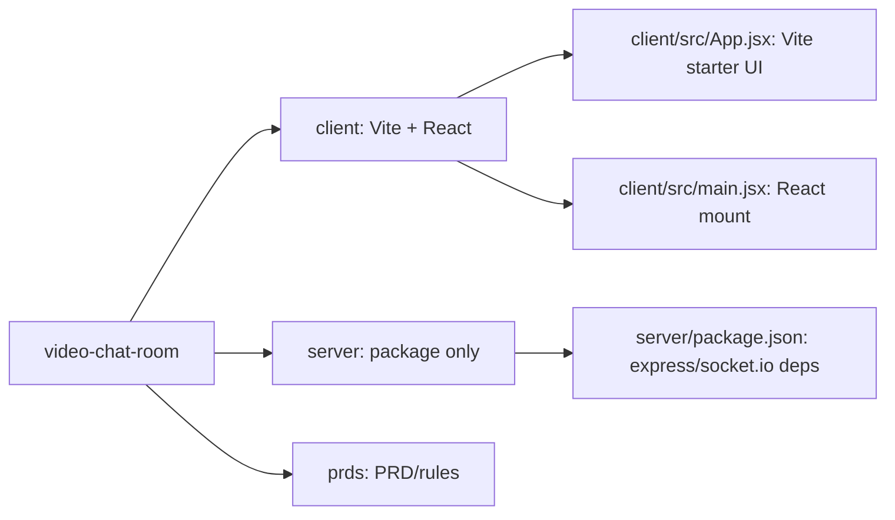
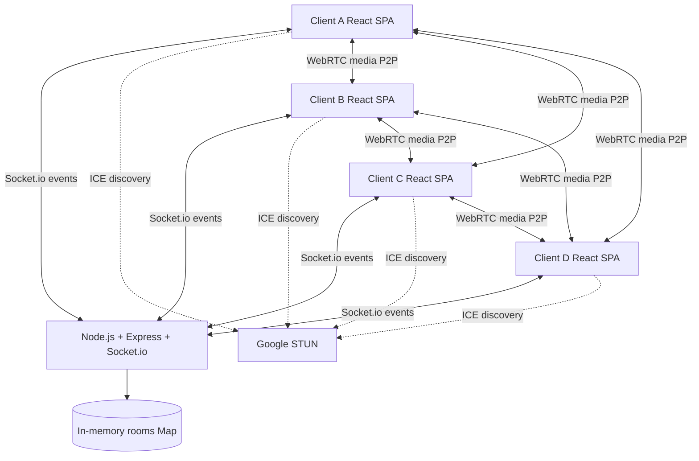
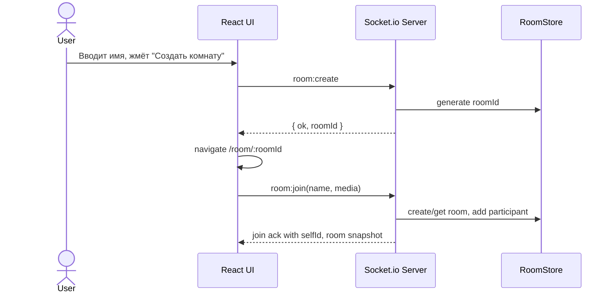
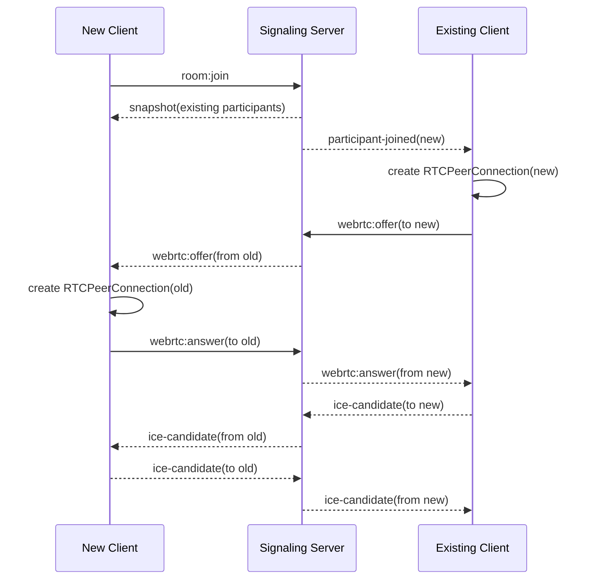
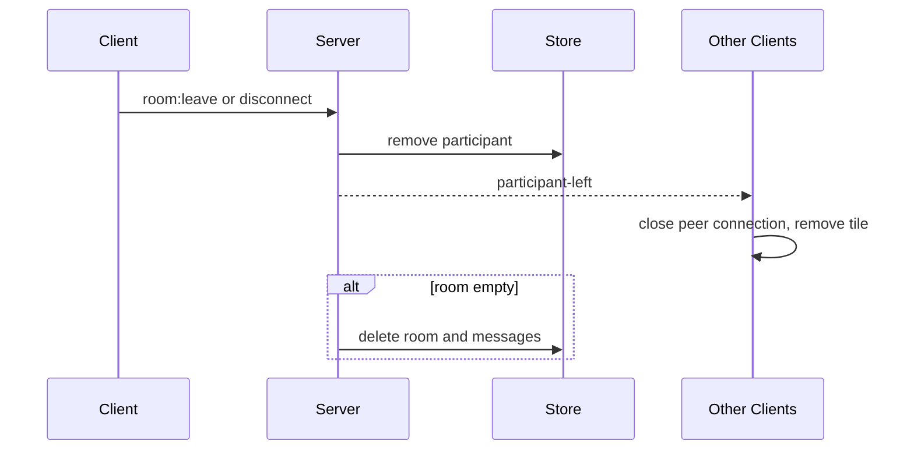

# Technical Design Document — Video Chat Room

| | |
|---|---|
| Документ | Technical Design Document |
| Feature name | `video-chat-room` |
| Версия | 1.0 |
| Основан на | `prds/prd-video-chat-room.md` |
| Правило | `prds/prd-design.mdc` |
| Дата | 2026-09-15 |

## 1. Overview / Контекст

Нужно реализовать веб-приложение видеочат-комнаты для 1-4 участников без регистрации: создание комнаты, вход по ссылке, WebRTC audio/video mesh, общий чат, список участников, управление микрофоном и камерой, системные события входа/выхода.

Входное наблюдение: пользователь указал PRD как `prds/video-chat-room/prd-video-chat-room.md`, но в текущей структуре найден файл `prds/prd-video-chat-room.md`. TDD сохраняется по целевому пути из правила: `prds/video-chat-room/design-video-chat-room.md`.

Ограничения из PRD:

- Frontend: React, JavaScript ES6+, русский UI, desktop-first от 1024px.
- Backend: Node.js, Express, Socket.io.
- Media: WebRTC mesh, без SFU/TURN, публичный Google STUN.
- Storage: только память сервера; без БД, без localStorage/sessionStorage для сохранения состояния.
- Room limit: максимум 4 участника, серверная атомарная проверка.
- Security: экранирование имени и сообщений, имя до 30 символов, без спецсимволов.
- HTTPS обязателен вне localhost для `getUserMedia`.

Production-код в рамках этого шага не пишется.

## 2. Current Architecture & Codebase Summary

Текущий проект — стартовый каркас, а не готовая реализация видеочата.



Просмотренные файлы:

| Путь | Класс/функция/модуль | Назначение / находка |
|---|---|---|
| `README.md` | Markdown | Только заголовок проекта `video-chat-room`. |
| `.gitignore` | Git ignore rules | Игнорируются `node_modules`, `dist`, логи, `*.local`; явного `.env` нет, но по правилу проекта `.env` не читать и не менять. |
| `prds/prd-video-chat-room.md` | PRD | Полные продуктовые требования: WebRTC mesh, Socket.io signaling/chat, room lifecycle, 4 участника, русский UI. |
| `prds/prd-design.mdc` | Rule | Обязательная структура TDD и запрет production-кода на этом шаге. |
| `client/package.json` | npm package | React `^19.2.8`, Vite `^8.3.0`, ESLint; `socket.io-client` отсутствует. |
| `client/vite.config.js` | Vite config | Стандартный React plugin, dev proxy не настроен. |
| `client/src/main.jsx` | React entry | Монтирует `<App />` в `StrictMode`. |
| `client/src/App.jsx` | React component | Стартовый Vite экран с `useState`, demo assets и counter; подлежит замене при реализации. |
| `client/src/App.css` | CSS | Стили starter UI, не соответствуют продукту видеочата. |
| `client/src/index.css` | CSS globals | Глобальные starter-переменные, светлая/тёмная тема, контейнер `#root`. |
| `client/public/icons.svg` | SVG sprite | Starter icons; можно заменить/расширить для UI кнопок. |
| `server/package.json` | npm package | CommonJS пакет с `express`, `socket.io`, `cors`; server entry `index.js` указан, но файла нет. |

Вывод: реализация должна добавить серверный entrypoint, состояние комнат, Socket.io contracts, клиентскую маршрутизацию/состояния, WebRTC orchestration, UI комнаты и тесты. Существующая клиентская разметка является шаблонной и не несёт доменной логики.

## 3. Proposed Architecture / High-Level Design

Архитектура: один Node.js signaling/chat server и React SPA. Сервер не пересылает медиа, а только координирует комнаты, участников, чат и WebRTC signaling.



Ключевые решения:

- Room ID берётся из URL `/room/:roomId`; при создании генерируется на клиенте или сервере и пользователь перенаправляется в комнату.
- Join выполняется только после ввода имени и проверки поддержки WebRTC.
- Серверная `join-room` операция синхронно проверяет размер комнаты перед добавлением участника.
- Каждый клиент создаёт отдельный `RTCPeerConnection` на каждого удалённого участника.
- Сторона, которая уже находится в комнате, инициирует offer новому участнику или наоборот по детерминированному правилу. Рекомендуемое правило: существующие участники создают offer для нового, чтобы новый участник не создавал сразу несколько конкурирующих offers без списка текущих peer connections.
- Chat history хранится в `Room.messages` до удаления комнаты.
- При disconnect участник удаляется, комната очищается при нуле участников.

## 4. Components & Interfaces

### Backend

`server/index.js`

- Создаёт Express app и HTTP server.
- Подключает Socket.io с CORS для dev origin.
- Отдаёт health endpoint `GET /health`.
- В production может отдавать статический `client/dist`.

`server/rooms/roomStore.js`

- In-memory `Map<roomId, Room>`.
- Операции: `joinRoom`, `leaveRoom`, `getRoom`, `appendMessage`, `updateParticipantMedia`.
- Гарантирует лимит 4 участника в синхронном участке обработки события.

`server/socket/handlers.js`

- Регистрирует Socket.io handlers.
- Валидирует payload.
- Рассылает события комнаты.
- Ретранслирует WebRTC `offer`, `answer`, `ice-candidate`.

`server/validation.js`

- Нормализует имя: trim, max 30.
- Проверяет разрешённый набор символов.
- Валидирует roomId и chat message.

### Frontend

`client/src/App.jsx`

- Верхнеуровневый state machine: landing/name form, joining, room, full-room, server-error, unsupported.
- Выбор экрана по `window.location.pathname`.

`client/src/socket/socketClient.js`

- Создаёт Socket.io client.
- Подписывает/отписывает события.
- Не хранит доменную логику WebRTC.

`client/src/webrtc/peerManager.js`

- Управляет `RTCPeerConnection` per participant.
- Добавляет local tracks, принимает remote tracks.
- Обрабатывает ICE candidates, connection state, cleanup.

`client/src/media/useLocalMedia.js`

- Проверяет `navigator.mediaDevices` и `RTCPeerConnection`.
- Получает audio/video по умолчанию.
- При отказе или отсутствии устройства возвращает частичный/пустой stream без выхода из комнаты.
- Toggle camera: `track.stop()` и пересоздание video track при включении.
- Toggle mic: `track.enabled = false/true`.

`client/src/components/NameGate.jsx`

- Форма имени и кнопки создания/входа.
- Валидирует имя до Socket.io join.

`client/src/components/RoomView.jsx`

- Layout комнаты: video grid, self-view, toolbar, chat panel, participants list.

`client/src/components/VideoTile.jsx`

- Показывает stream или заглушку, имя, mute/camera indicators.

`client/src/components/ChatPanel.jsx`

- Отрисовывает escaped text как React text nodes.
- Отправляет непустые сообщения.
- Автопрокрутка вниз.

## 5. Data Model & DB Changes

БД не используется. Все данные хранятся в памяти процесса Node.js.

```js
// Conceptual shape, not production code
Room = {
  id: string,
  participants: Map<socketId, Participant>,
  messages: ChatMessage[],
  createdAt: number
}

Participant = {
  id: string,          // socket.id
  name: string,        // display name
  joinedAt: number,
  media: {
    audioEnabled: boolean,
    videoEnabled: boolean
  }
}

ChatMessage = {
  id: string,
  type: 'user' | 'system',
  senderId?: string,
  senderName?: string,
  text: string,
  createdAt: number
}
```

Индексы и миграции не нужны. При масштабировании на несколько Node.js процессов текущая модель потребует Redis adapter для Socket.io и общий room store; для v1 это out of scope.

## 6. API / Contracts

### HTTP

`GET /health`

Response:

```json
{ "status": "ok" }
```

### Socket.io client -> server

`room:create`

Создаёт roomId и возвращает его ack-ом. Альтернатива: клиент генерирует UUID/short-id и сразу вызывает `room:join`; предпочтительно серверное создание для единого формата.

```json
{}
```

Ack:

```json
{ "ok": true, "roomId": "abc123" }
```

`room:join`

```json
{
  "roomId": "abc123",
  "name": "Алекс",
  "media": { "audioEnabled": true, "videoEnabled": true }
}
```

Ack success:

```json
{
  "ok": true,
  "selfId": "socket-id",
  "room": {
    "id": "abc123",
    "participants": [],
    "messages": []
  }
}
```

Ack full:

```json
{ "ok": false, "code": "ROOM_FULL", "message": "Комната заполнена" }
```

`media:update`

```json
{ "audioEnabled": false, "videoEnabled": true }
```

`chat:send`

```json
{ "text": "Привет" }
```

`webrtc:offer`

```json
{ "to": "socket-id", "description": { "type": "offer", "sdp": "..." } }
```

`webrtc:answer`

```json
{ "to": "socket-id", "description": { "type": "answer", "sdp": "..." } }
```

`webrtc:ice-candidate`

```json
{ "to": "socket-id", "candidate": { "candidate": "...", "sdpMid": "0", "sdpMLineIndex": 0 } }
```

`room:leave`

Явный выход перед закрытием/переходом. `disconnect` обрабатывается так же.

### Socket.io server -> client

`room:participant-joined`

```json
{ "participant": { "id": "socket-id", "name": "Алекс", "media": { "audioEnabled": true, "videoEnabled": true } } }
```

`room:participant-left`

```json
{ "participantId": "socket-id", "name": "Алекс" }
```

`room:participants`

```json
{ "participants": [] }
```

`chat:message`

```json
{
  "id": "msg-id",
  "type": "user",
  "senderId": "socket-id",
  "senderName": "Алекс",
  "text": "Привет",
  "createdAt": 1790000000000
}
```

`media:updated`

```json
{ "participantId": "socket-id", "media": { "audioEnabled": false, "videoEnabled": true } }
```

`webrtc:offer`, `webrtc:answer`, `webrtc:ice-candidate`

Сервер добавляет `from`.

```json
{ "from": "socket-id", "description": { "type": "offer", "sdp": "..." } }
```

## 7. Data & Control Flows

### Создание комнаты



### Вход в комнату и WebRTC mesh



### Выход



## 8. Error Handling & Edge Cases

| Случай | Поведение |
|---|---|
| Пустое имя | Клиент не отправляет join, показывает ошибку ввода. |
| Имя > 30 символов | Клиент обрезает/запрещает, сервер повторно валидирует. |
| Спецсимволы в имени | Запрет по regex на клиенте и сервере; отображение всё равно через escaped text. |
| 5-й участник | `room:join` ack `{ ok:false, code:"ROOM_FULL" }`; UI показывает «Комната заполнена» и retry. |
| Одновременный вход за последний слот | Обработка `room:join` синхронна в event loop; проверка и добавление выполняются одним критическим участком. |
| Отказ camera/mic permission | Пользователь входит с выключенными устройствами, видит сообщение о доступе. |
| Нет камеры/микрофона | Вход разрешён, отсутствующее устройство помечается выключенным. |
| Потеря устройства | Остановить соответствующий track, обновить `media:update`, показать заглушку/индикатор. |
| Socket server недоступен | UI показывает ошибку сервера и кнопку повторить подключение. |
| WebRTC unsupported | UI показывает «WebRTC не поддерживается». |
| STUN недоступен / ICE failed | Плитка peer остаётся без media, можно показать статус «Не удалось установить медиасоединение». Комната и чат продолжают работать. |
| Закрытие вкладки | `disconnect` удаляет участника; формулировка системного сообщения как обычный выход. |
| Перезагрузка | Новый вход с повторным вводом имени; старый socket удаляется. |
| Несколько вкладок | Каждая вкладка отдельный socket и слот. |
| HTML/JS в сообщении | Не использовать `dangerouslySetInnerHTML`; React text nodes + серверная нормализация длины. |

## 9. Performance & Scalability

Цели:

- До 4 участников на комнату.
- До 6 peer connections на комнату.
- Media latency в локальной сети: до 500 мс.
- Chat/signaling latency: best effort через Socket.io, целево < 200 мс в LAN/dev.

Ограничения:

- Mesh topology масштабируется квадратично и не подходит для >4 участников.
- Без TURN часть пользователей за строгим NAT может не установить P2P media.
- In-memory room store не переживает рестарт сервера и не работает корректно при нескольких процессах без adapter.

Оптимизации v1:

- Не хранить media на сервере.
- Не пересылать большие payload в чате; ввести лимит сообщения, например 1000 символов.
- Очищать peer connections и tracks при выходе.
- Для 3-4 участников использовать CSS grid 2x2 без тяжёлых layout recalculations.

## 10. Security & Compliance

- AuthN/AuthZ отсутствуют по PRD; доступ по roomId является штатным поведением.
- Room ID должен быть достаточно непредсказуемым, хотя защита от угадывания не является требованием. Рекомендуемый формат: `crypto.randomUUID()` или короткий id с достаточной энтропией.
- Сервер валидирует все Socket.io payloads, не доверяет клиенту.
- Имена и сообщения отображаются только как текст; HTML не интерпретируется.
- Ограничить длины:
  - `name`: 1-30 символов после trim.
  - `message.text`: 1-1000 символов после trim.
  - `roomId`: фиксированный допустимый regex, например `^[a-zA-Z0-9_-]{6,64}$`.
- CORS в dev ограничить `http://localhost:5173`; в production — origin сайта.
- WebRTC media защищается штатным DTLS-SRTP; E2E encryption сверх WebRTC не требуется.
- Персональные данные: отображаемое имя и временные сообщения живут только в памяти до удаления комнаты.
- `.env` не читать и не менять; новые переменные документировать в `.env.example`, если будут добавляться на этапе реализации.

## 11. Testing Strategy

### Unit

- `roomStore`: создание комнаты, join, лимит 4, удаление последнего участника, история сообщений.
- `validation`: имя, roomId, message limits, спецсимволы.
- `peerManager`: можно тестировать через mocks для `RTCPeerConnection`.

### Integration

- Socket.io server/client tests:
  - join creates room if missing;
  - 5-й участник получает `ROOM_FULL`;
  - chat message рассылается всем и попадает в history;
  - disconnect генерирует participant-left и удаляет пустую комнату;
  - WebRTC signaling ретранслируется только адресату в той же комнате.

### E2E

- Playwright в Chromium:
  - стартовый экран, валидация имени;
  - создание комнаты и URL;
  - вход второго участника в двух browser contexts;
  - чат и history для позднего входа;
  - mute/camera UI state;
  - full room state для 5-го участника.

Для media E2E использовать fake devices:

```bash
chromium --use-fake-device-for-media-stream --use-fake-ui-for-media-stream
```

### Manual QA

- Chrome, Firefox, Edge 100+.
- localhost и HTTPS окружение.
- Отказ permissions.
- Нет физической камеры.
- Закрытие вкладки, refresh, несколько вкладок.

## 12. Deployment & Migration Plan

Миграций БД нет.

Рекомендуемый dev setup:

- `client`: Vite dev server.
- `server`: Node.js Socket.io server.
- Vite proxy `/socket.io` и `/health` на backend или явный `VITE_SIGNALING_URL` в `.env.example`.

Production варианты:

1. Один Node.js процесс отдаёт `client/dist` и Socket.io на том же origin.
2. Раздельный static hosting + Node signaling server с корректным CORS.

Шаги внедрения:

1. Добавить backend entrypoint и room/socket modules.
2. Добавить client Socket.io dependency и WebRTC modules.
3. Заменить starter UI на продуктовые экраны.
4. Добавить тесты.
5. Настроить build/start scripts.
6. Проверить HTTPS deployment или документировать запуск через localhost.

Rollback:

- Так как состояние ephemeral и БД нет, rollback — возврат предыдущего build/server процесса.
- При рестарте сервера активные комнаты будут потеряны; это допустимо для v1, но нужно учитывать при деплое.

## 13. Risks & Mitigations

| Риск | Влияние | Митигация |
|---|---|---|
| Нет TURN | У части пользователей media может не соединиться | Явное состояние ICE failed; PRD допускает отсутствие TURN. |
| Mesh при 4 участниках нагружает клиент | CPU/network на слабых машинах | Лимит 4, cleanup tracks, не вводить HD constraints как обязательные. |
| In-memory store | Потеря комнат при рестарте | Принять для v1; указать как ограничение. |
| Socket.io auto-reconnect по умолчанию конфликтует с PRD | Участник может вернуться без ручного входа | Отключить/контролировать auto-reconnect или при reconnect требовать новый join/name. |
| React StrictMode может дважды вызывать effects в dev | Дубли peer connections/listeners | Идемпотентный cleanup effects, refs для single initialization. |
| Camera toggle через `enabled=false` не гасит лампочку | Нарушение PRD | При выключении video делать `track.stop()` и renegotiation/replaceTrack(null). |
| XSS в чате/именах | Security issue | Запрет `dangerouslySetInnerHTML`, серверная валидация, React text rendering. |
| Одновременный join | Превышение лимита комнаты | Синхронная проверка и добавление в одном handler. |

## 14. Open Questions / TBD

- TBD: Финальный формат roomId: UUID, nanoid-like короткий id или серверный slug. Рекомендация: короткий URL-safe id 10-12 символов с достаточной энтропией.
- TBD: Нужен ли один production Node server для статики и Socket.io или раздельный деплой client/server.
- TBD: Точный regex разрешённых символов имени. Рекомендация для русского UI: буквы Unicode, цифры, пробел, дефис, подчёркивание; запрет HTML-значимых спецсимволов.
- TBD: Нужен ли UI-статус для ICE failed на конкретной плитке. PRD требует корректную реакцию на STUN issues, но не задаёт текст.
- TBD: Лимит сообщения. Рекомендация: 1000 символов.
- TBD: Нужно ли добавлять отдельный `.env.example` с `VITE_SIGNALING_URL`, `CLIENT_ORIGIN`, `PORT`; `.env` не читать и не изменять.
